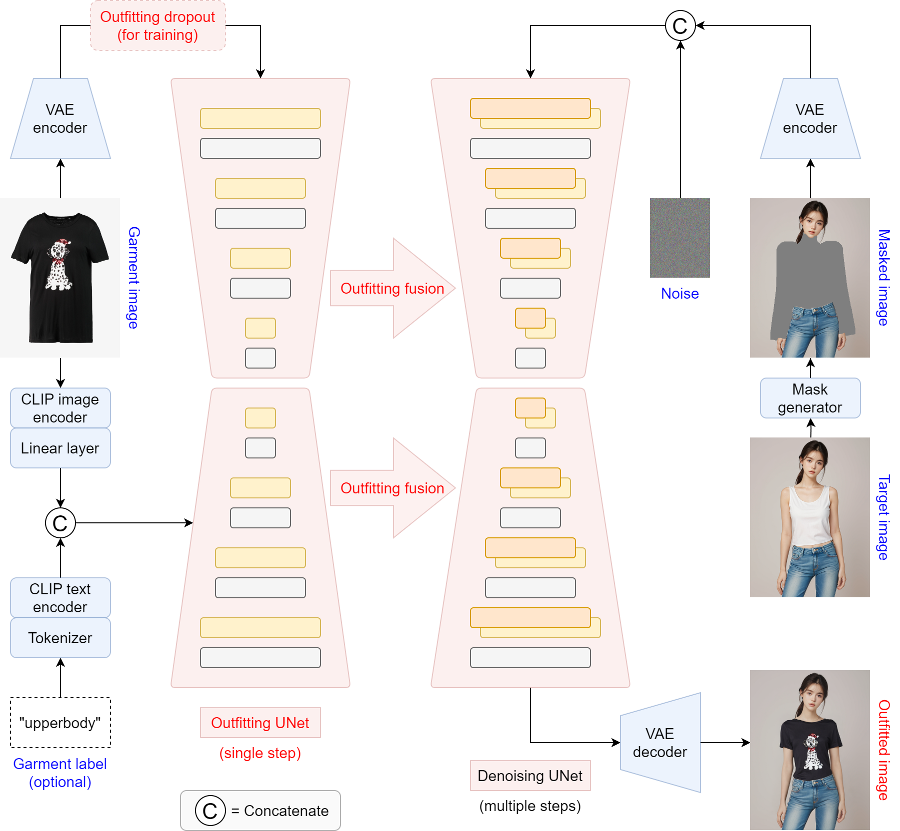

# OOTDiffusion
This repository is the official implementation of OOTDiffusion

[Try our OOTDiffusion](https://ootd.ibot.cn/)


> **OOTDiffusion: Outfitting Fusion based Latent Diffusion for Controllable Virtual Try-on**<br>
> [Yuhao Xu](https://scholar.google.com/citations?user=FF7JVLsAAAAJ&hl=zh-CN), [Tao Gu](https://github.com/T-Gu), [Weifeng Chen](https://github.com/chenshine1), Chengcai Chen<br>
> Xiao-i Research

&nbsp;
&nbsp;

## Installation

1. Clone the repository

```sh
git clone https://github.com/levihsu/OOTDiffusion
```

2. Create a conda environment and install the required packages

```sh
conda create -n ootd python==3.10
conda activate ootd
pip install torch==2.0.1 torchvision==0.15.2 numpy==1.24.4 opencv-python==4.7.0.72 pillow==9.4.0 diffusers==0.24.0 transformers==4.36.2 accelerate==0.26.1 matplotlib==3.7.4 tqdm==4.64.1 gradio==4.16.0
```

## Inference

1. Half-body model

```sh
cd OOTDiffusion/run
python run_ootd.py --model_path <model-image-path> --cloth_path <cloth-image-path> --scale 2.0 --sample 4
```

2. Full-body model 

> Garment category must be paired: 0 = upperbody; 1 = lowerbody; 2 = dress

```sh
cd OOTDiffusion/run
python run_ootd.py --model_path <model-image-path> --cloth_path <cloth-image-path> --model_type dc --category 2 --scale 2.0 --sample 4
```

## TODO List
- [ ] Paper
- [x] Gradio demo
- [x] Inference code
- [ ] Model weights
- [ ] Training code
