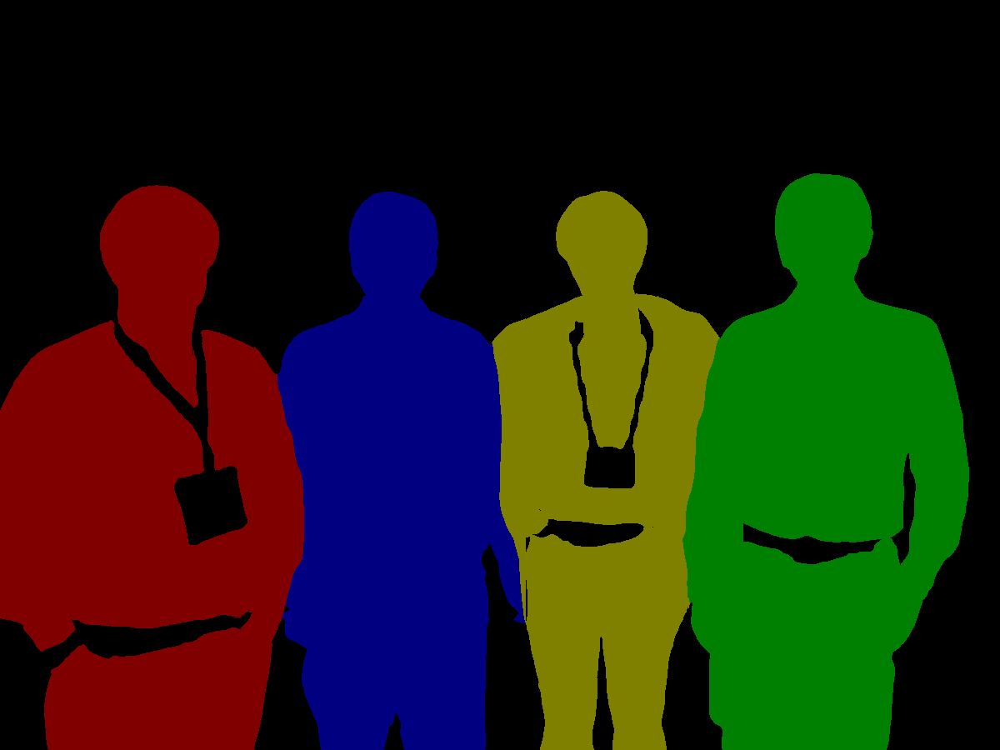
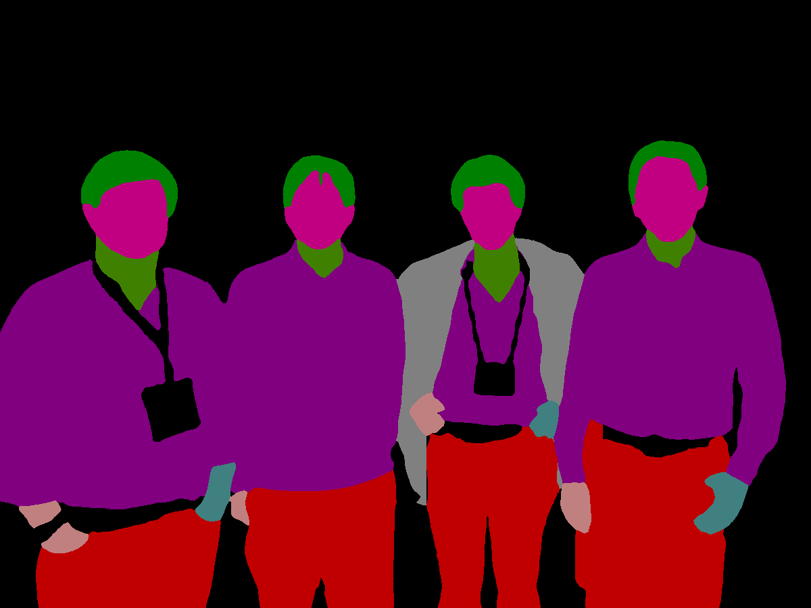
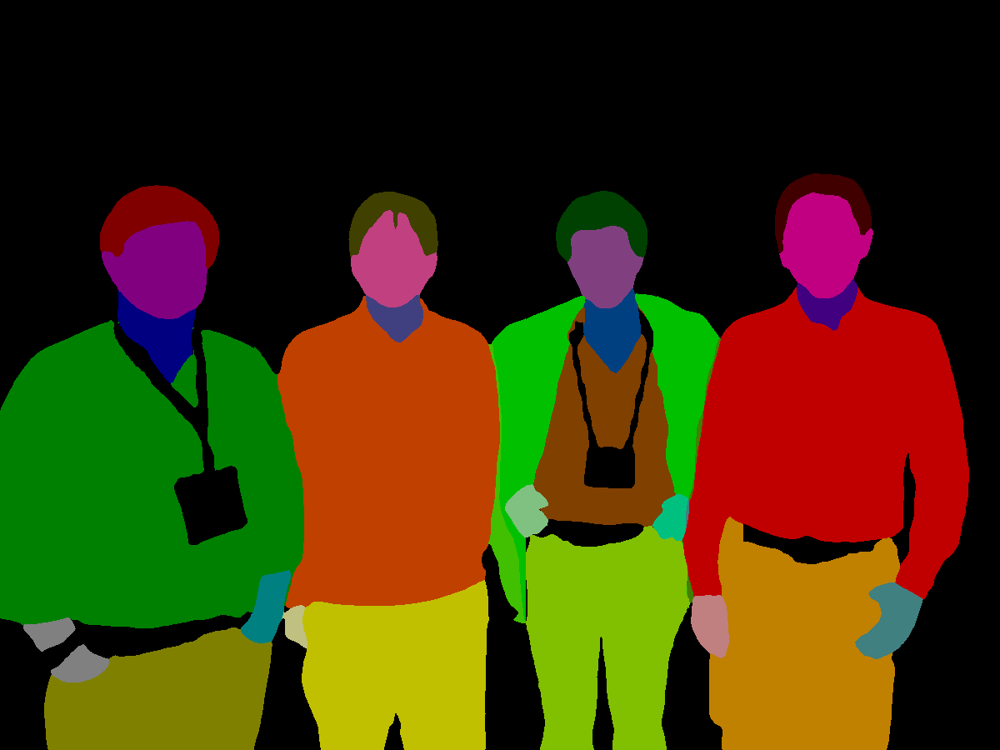

# Self Correction for Human Parsing


[](https://opensource.org/licenses/MIT)

An out-of-box human parsing representation extractor.

Our solution ranks 1st for all human parsing tracks (including single, multiple and video) in the third LIP challenge!

 

Features:
- [x] Out-of-box human parsing extractor for other downstream applications.
- [x] Pretrained model on three popular single person human parsing datasets.
- [x] Training and inferecne code.
- [x] Simple yet effective extension on multi-person and video human parsing tasks.

## Requirements

```
conda env create -f environment.yaml
conda activate schp
pip install -r requirements.txt
```

## Simple Out-of-Box Extractor

The easiest way to get started is to use our trained SCHP models on your own images to extract human parsing representations. Here we provided state-of-the-art [trained models](https://drive.google.com/drive/folders/1uOaQCpNtosIjEL2phQKEdiYd0Td18jNo?usp=sharing) on three popular datasets. Theses three datasets have different label system, you can choose the best one to fit on your own task.

**LIP** ([exp-schp-201908261155-lip.pth](https://drive.google.com/file/d/1k4dllHpu0bdx38J7H28rVVLpU-kOHmnH/view?usp=sharing))

* mIoU on LIP validation: **59.36 %**.

* LIP is the largest single person human parsing dataset with 50000+ images. This dataset focus more on the complicated real scenarios. LIP has 20 labels, including 'Background', 'Hat', 'Hair', 'Glove', 'Sunglasses', 'Upper-clothes', 'Dress', 'Coat', 'Socks', 'Pants', 'Jumpsuits', 'Scarf', 'Skirt', 'Face', 'Left-arm', 'Right-arm', 'Left-leg', 'Right-leg', 'Left-shoe', 'Right-shoe'.

**ATR** ([exp-schp-201908301523-atr.pth](https://drive.google.com/file/d/1ruJg4lqR_jgQPj-9K0PP-L2vJERYOxLP/view?usp=sharing))

* mIoU on ATR test: **82.29%**.

* ATR is a large single person human parsing dataset with 17000+ images. This dataset focus more on fashion AI. ATR has 18 labels, including 'Background', 'Hat', 'Hair', 'Sunglasses', 'Upper-clothes', 'Skirt', 'Pants', 'Dress', 'Belt', 'Left-shoe', 'Right-shoe', 'Face', 'Left-leg', 'Right-leg', 'Left-arm', 'Right-arm', 'Bag', 'Scarf'.

**Pascal-Person-Part** ([exp-schp-201908270938-pascal-person-part.pth](https://drive.google.com/file/d/1E5YwNKW2VOEayK9mWCS3Kpsxf-3z04ZE/view?usp=sharing))

* mIoU on Pascal-Person-Part validation: **71.46** %.

* Pascal Person Part is a tiny single person human parsing dataset with 3000+ images. This dataset focus more on body parts segmentation. Pascal Person Part has 7 labels, including 'Background', 'Head', 'Torso', 'Upper Arms', 'Lower Arms', 'Upper Legs', 'Lower Legs'.

Choose one and have fun on your own task!

To extract the human parsing representation, simply put your own image in the `INPUT_PATH` folder, then download a pretrained model and run the following command. The output images with the same file name will be saved in `OUTPUT_PATH`

```
python simple_extractor.py --dataset [DATASET] --model-restore [CHECKPOINT_PATH] --input-dir [INPUT_PATH] --output-dir [OUTPUT_PATH]
```

**[Updated]** Here is also a [colab demo example](https://colab.research.google.com/drive/1JOwOPaChoc9GzyBi5FUEYTSaP2qxJl10?usp=sharing) for quick inference provided by [@levindabhi](https://github.com/levindabhi).

The `DATASET` command has three options, including 'lip', 'atr' and 'pascal'. Note each pixel in the output images denotes the predicted label number. The output images have the same size as the input ones. To better visualization, we put a palette with the output images. We suggest you to read the image with `PIL`.

If you need not only the final parsing images, but also the feature map representations. Add `--logits` command to save the output feature maps. These feature maps are the logits before softmax layer.

## Dataset Preparation

Please download the [LIP](http://sysu-hcp.net/lip/) dataset following the below structure.

```commandline
data/LIP
|--- train_imgaes # 30462 training single person images
|--- val_images # 10000 validation single person images
|--- train_segmentations # 30462 training annotations
|--- val_segmentations # 10000 training annotations
|--- train_id.txt # training image list
|--- val_id.txt # validation image list
```

## Training

```
python train.py 
```
By default, the trained model will be saved in `./log` directory. Please read the arguments for more details.

## Evaluation
```
python evaluate.py --model-restore [CHECKPOINT_PATH]
```
CHECKPOINT_PATH should be the path of trained model.

## Extension on Multiple Human Parsing

Please read [MultipleHumanParsing.md](./mhp_extension/README.md) for more details.

## Citation

Please cite our work if you find this repo useful in your research.

```latex
@article{li2020self,
  title={Self-Correction for Human Parsing}, 
  author={Li, Peike and Xu, Yunqiu and Wei, Yunchao and Yang, Yi},
  journal={IEEE Transactions on Pattern Analysis and Machine Intelligence}, 
  year={2020},
  doi={10.1109/TPAMI.2020.3048039}}
```

## Visualization

* Source Image.

* LIP Parsing Result.

* ATR Parsing Result.

* Pascal-Person-Part Parsing Result.

* Source Image.

* Instance Human Mask.

* Global Human Parsing Result.

* Multiple Human Parsing Result.



## Related
Our code adopts the [InplaceSyncBN](https://github.com/mapillary/inplace_abn) to save gpu memory cost.

There is also a [PaddlePaddle](https://github.com/PaddlePaddle/PaddleSeg/tree/develop/contrib/ACE2P) Implementation of this project.
